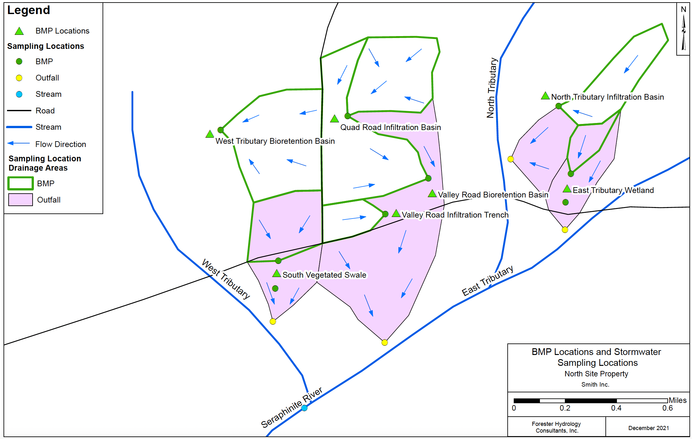

# Stormwater Monitoring Database Implementation Using SQL
Database Design, Fall 2021

## Table of Contents

- [Project Scenario](#project-scenario)
- [Database Model - Entity Relationship Diagram](#database-model---entity-relationship-diagram)
- [File Summary](#file-summary)
- [Database Setup Instructions](#database-setup-instructions)
- [Additional Information](#additional-information)
- [Database Use Discussion](#database-use-discussion)

## Project Scenario

The North Site property is owned by Smith Inc. and is currently undergoing
environmental remediation in order to remove and monitor industrial 
contaminants from industrial operations that occurred in the 1980s. Smith Inc. 
has hired Forester Hydrology Consultants, Inc. to perform stormwater monitoring 
at the site to comply with the California State Water Board requirements during 
the remediation process. The 930-acre site consists of both natural areas and 
areas where industrial activity occurred. Three tributaries of the Seraphinite 
River flow through the property and collect stormwater runoff. Stormwater Best 
Management Practices (BMPs) have been installed throughout the property to 
reduce runoff contaminants before runoff enters the tributaries. The site BMPs 
include infiltration basins, bioretention basins, an infiltration trench, a 
vegetated swale, and an artificial wetland. 

Stormwater runoff samples are collected during at least three storms at each 
monitoring location for each wet weather season. Samples are collected directly 
upstream and/or downstream of each BMP, at each outfall to the tributaries, and 
from the confluence of the three tributaries. Samples are tested for parameters 
of concern. During each sampled storm, one duplicate sample is collected from 
one of the monitoring locations to check the consistency of the sampling and 
testing process and one blank sample is collected using distilled water to 
evaluate the accuracy of the sampling process. The site soil includes Hydrologic
Soil Groups A, B, C, and D. Assumed infiltration rates for these soil types and 
delineated drainage areas for the sampling locations may be used to estimate the
volume of water and the mass of contaminants that flow to these monitoring 
locations.

### Site Map

### Example Client Questions

1. What is the maximum blank concentration for dissolved Mercury?
2. For dissolved Lead, what is the mean of the difference between each pair of
   duplicate concentration results normalized by the pair average 
   concentration?
3. What is the estimated total mass of dissolved Copper that enters the 
   Seraphinite River from the site during the first storm of the 2022 wet 
   weather season?
4. What monitoring location has the maximum concentration result for each
   parameter?
5. What is the difference between the upstream and downstream concentrations 
   for dissolved Lead at the East Tributary Wetland during the first storm of
   the 2022 wet weather season?
6. How many days before the first storm of the 2022 wet weather season did the 
   West Tributary Bioretention Basin undergo maintenance?
   
### Business Rules

* BMP sampling locations must be directly upstream or directly downstream of a
  particular stormwater BMP. Infiltration and bioretention BMPs only have 
  upstream sampling locations since it is assumed that all water infiltrates. 
  Flow-through BMPs have both upstream and downstream sampling locations.
* Each sample must be composed of stormwater or distilled water. Distilled 
  water is used for blank samples.
* Each stormwater sample is collected at a particular sampling location.
* Blank samples do not have an associated sampling location.
* Each monitoring location has zero, one, or two samples collected during a 
  single storm.
* Each sample must have one concentration result for each evaluated parameter.
   * (Note that concentration rows have only been inserted for a single, 
     example storm since each storm would have more than 400 rows of 
	 corresponding concentration data. Samples associated with all other storms 
	 currently have no concentration results stored in the database.)
* The same testing method is always used to evaluate each parameter. For 
  example, testing method D1688-07 A is always used to evaluate Dissolved 
  Copper.
* Non-detect parameter results, i.e. results that are below the lab detection 
  limit, must be set the to the detection limit for all data statistics and 
  calculations.
* Duplicate sample concentrations for a particular monitoring location during 
  a storm must be averaged for all data statistics and calculations except 
  statistics and calculations that use the duplicates to evaluate the 
  consistency of the sampling method.
* A sample’s corresponding duplicate sample must have been collected from the 
  same sample location during the same storm.
* Concentration results for blank samples shall only be used to evaluate the 
  accuracy of the sampling and testing methods and shall not be used in any 
  other data statistics or calculations.
* Maintenance dates for each stormwater BMP must occur after BMP installation.
* The sample time for each sample must occur during the corresponding sampled
  storm.
* A sample location’s pervious drainage area must be smaller than the sample
  location’s total drainage area.
* For each sample location, the pervious drainage area plus the drainage area
  corresponding to each soil type should be equal to the total drainage area.

   
## Database Model - Entity Relationship Diagram

## File Summary

Programming files are described below.

**sql\_insert.cpp and sql\_insert.h** - Contain the declaration and definition for the
    sql\_insert function, which creates SQL insert statements based on a csv text
    file. For more explanation, see [Additional Information](#additional-information).

**main.cpp** - Calls the sql\_insert function in order to create all SQL insert 
    statements for the database. For more explanation, see [Additional Information](#additional-information).

**325design.sql** - Includes drop table and create table statements for twelve 
    tables: parameter, storm, stormwater\_BMP, maintenance, sampling\_location,
    BMP\_sampling\_location, sample, stormwater\_sample, concentration, 
	data\_flag, soil\_type, and soil\_area.

**325populate.sql** - Deletes the contents of all twelve tables and inserts rows 
    into the tables. Inserts 26 rows into parameter, 11 rows into storm, 7 rows 
    into stormwater\_BMP, 23 rows into maintenance, 14 rows into 
    sampling\_location, 9 rows into BMP\_sampling\_location, 176 rows into sample, 
    165 rows into stormwater\_sample, 416 rows into concentration, 329 rows into 
    data\_flag, 4 rows into soil\_type, and 14 rows into soil\_area.

**325show-contents.sql** - Displays the contents of all twelve tables. Spools to
    325result-contents.txt.

**325queries.sql** - Contains eight queries and query descriptions that demonstrate 
    how the database may be used. Also contains the definition of the 
    default\_sample\_id view. Spools to 325query-results.txt.

**325report1.sql** - Contains the definition of the conc\_for\_calculation view. 
    Displays a report showing the processed concentration results for each 
    parameter for each stormwater sample. Spools to 325report1-results.txt. 
    Utilizes the defalt\_sample\_id view.

**325report2.sql** - Displays a report showing the processed concentration results i
    for each stormwater sample at an outfall sampling location, and shows the 
    average concentration result for each parameter. Spools to 
    325report2-results.txt. Utilizes the conc\_for\_calculation view.

**325report3.sql** - Displays a report showing the upstream and downstream
    concentration results and the percent difference for flow-through stormwater    
	BMPs. Spools to 325report3-results.txt. Utilizes the conc\_for\_calculation 
    view.

**date-format.sql** - Alters the session date format to ‘mm-dd-yyyy’. This 
    script is called within the 325queries.sql script.

**time-format.sql** - Alters the session date format to ‘mm-dd-yyyy hh24:mi’. 
    This script is called within the 325queries.sql script.

## Database Setup Instructions

The database setup steps are described below. Note that the cpp files do not 
need to be re-run for database setup. However, if the user would like to 
automate the creation of more SQL insert statements, the main.cpp file may 
be edited and re-run.

1. Run 325design.sql to create tables.
2. Run 325populate.sql to populate tables.
3. Run 325show\_contents.sql to display the contents of the database.
4. Run 325queries.sql to generate query results and the conc\_for\_calculation 
   view.
5. Run 325report1.sql to generate the first report.
6. Run 325report2.sql and 325report3.sql in any order to generate the second and 
   third reports.

## Additional Information

* **Geospatial Data Generation:** ArcMap was used to create a portion of the 
  geospatial data that is stored in the database, including latitude and 
  longitude positions for stormwater BMPs, latitude and longitude positions 
  for sampling locations, and sampling location drainage areas. The ArcMap 
  folder contains the following files.
   * StormwaterSampling.pdf - A site map displaying the geospatial data. 
     Displays streams, roads, BMP locations, sampling locations, BMP and 
	 outfall drainage areas, and flow direction arrows.
   * StormwaterSampling.mpk - An ArcMap Map Package file that contains the 
     created geospatial information layers.
   * StormSamplingGeodatabase folder - Contains the geodatabase created in 
     ArcMap.
   * Table\_Export folder - Contains the exported geospatial data text files 
     that were used to create csv text files corresponding to the database 
	 tables.
* **Insert Statement Automation:** C++ was used to automate the creation of 
  table insert statements due to the volume of data. The cpp folder contains 
  the following files.
   * csv text files for each database table
   * sql\_insert.h and sql\_insert.cpp - Contain the declaration and definition 
     for the sql\_insert function. The sql\_insert function reads a csv file 
	 and appends prompt statements and insert statements to a SQL population file. 
	 The script creates insert statements where all values are specified and also 
	 creates insert statements for rows with null values.
   * main.cpp - Declares an array of table names and calls the sql\_insert 
     function for each table. Creates the file 325populate.sql, which contains 
	 prompt statements and insert statements for each table. Note that the 
	 325populate.sql file was later edited to include comments and to limit 
	 line-lengths to 80 characters.
* **Data Volume:** The database contains 12 tables and 1,194 rows of data.
* **Sources:** 14 sources were used. One source is quoted in 325design.sql, and 
  the remaining sources were used during the creation of data. One citation 
  appears in 325design.sql, and the remaining citations appear in 
  325population.sql.
* **Functions/Statements Used:**
   * check statements in 325design.sql.
   * to\_date function in 325population.sql to create date values with time.
   * nls\_date\_format is altered in date-format.sql and time-forma.sql. These 
     scripts are called within the 325show-contents.sql script.
   * spool with append in 325show\-contents.sql in order to not spool “session 
     altered.”
   * Creation of views in 325queries.sql and 325report1.sql.
   * months\_between function in 325queries.sql.
   * union of select statements in 325queries.sql and 325report1.sql.
   * to\_char function to add a percent sign to numbers in 325report3.sql.
   
## Database Use Discussion

The primary purpose of the Stormwater Monitoring Database is to maintain all
required monitoring data and to aid in the creation of reports to meet remediation and
stormwater monitoring requirements for the North Site property as prescribed by the
California State Water Board. Written reports will include plots, tables, statistical
analysis, and descriptions of the stormwater monitoring concentration results. The
database will also help with the remediation process. If the parameters of concern have
outfall concentrations higher than permitted levels, additional stormwater BMPs will be
installed onsite and existing stormwater BMPs may be improved in order to reduce the
impacts to the Seraphinite River.

The database may also be utilized alongside a hydrologic and hydraulic model
of the site. For instance, a model could be created using the Storm Water Management
Model (SWMM) software from the United States Environmental Protection Agency.
Hydrologic and hydraulic models are used to model a watershed or project site, which
includes simulating historical storms, stormwater runoff, rainfall infiltration across a
watershed, flow rates at stormwater BMPs, and infiltration at stormwater BMPs. Such
a model would use data from the database, such as drainage areas, pervious drainage
areas, soil types for stormwater BMPs and other monitoring locations, and soil type
infiltration rates. The model would utilize a more detailed storm record than is currently
saved in the database, which would include hourly rainfall data for the last 10 years.
The model would also contain structural information about the stormwater BMPs in
order to calculate the infiltration and flow rates. Once the model is created and
calibrated based on onsite flow data, the model results can be used in conjunction with
the database to provide a more complete view of the site. For instance, the model will
be able to estimate the runoff for all sampling locations, which can then be used with
the concentration results stored in the database to estimate the mass of contaminants
that flow into the Seraphinite River tributaries. The model can also be used to design
any additional stormwater BMPs that are necessary for reducing parameter
concentrations throughout the site. More tables may be added to the database to store
additional data that is needed for the hydrologic and hydraulic model.